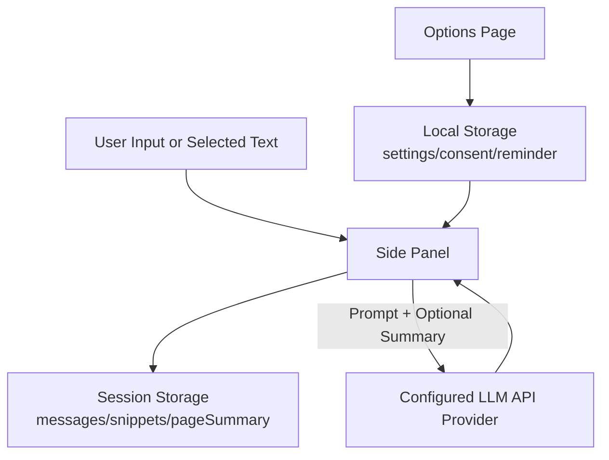

# Web LLM Assistant

A page-aware browser extension that lets you chat with any OpenAI-compatible LLM in a side panel, with optional selected-text context from the current webpage.

## Languages

- English (this page)
- [日本語](https://github.com/SunParis/Web-LLM-Assistant/blob/main/docs/README.ja.md)
- [繁體中文](https://github.com/SunParis/Web-LLM-Assistant/blob/main/docs/README.zh-Hant.md)
- [简体中文](https://github.com/SunParis/Web-LLM-Assistant/blob/main/docs/README.zh-Hans.md)

## Features

- **Security & Privacy Enhancements**:
  - API keys are securely encrypted locally using the Web Crypto API (`AES-GCM`).
  - Side panel states are isolated and managed per-tab to prevent context leaks.
  - Page URLs are hashed (`SHA-256`) for session keys and excluded from AI prompts to protect browsing history.
  - Storage access levels are strictly enforced (`TRUSTED_CONTEXTS`).

- Side panel chat interface for each tab/page session.
- Add selected webpage text as context via right-click menu.
- Edit, resend, copy, and delete chat messages.
- Stop generation while streaming.
- Automatic per-page summary generation before answering (with fallback if summary fails).
- Summary status hints in assistant messages ("trying", "success", "failed").
- Two-step assistant output: summary status line, then final answer line.
- Resend/edit removes temporary summary-status lines while keeping cached summary.
- Clearing current page chat keeps cached page summary for reuse.
- Per-page session history (stored in extension session storage).
- Configurable API endpoint, API key, model, prompt, and sampling params.
- UI language options:
  - English (`en`)
  - Japanese (`ja`)
  - Traditional Chinese (`zh-Hant`)
  - Simplified Chinese (`zh-Hans`)

## Project Structure

- `src/manifest.json`: Extension manifest (MV3).
- `src/background.js`: Context menu and side panel opening logic.
- `src/sidepanel.html|css`: Side panel UI shell and styles.
- `src/sidepanel.js`: Side panel orchestration (state flow, Chrome API integration).
- `src/sidepanel_ui.js`: Message/snippet rendering and UI text/theme application.
- `src/sidepanel_events.js`: Side panel event hub and extension points.
- `src/sidepanel_api.js`: Model API requests, SSE parsing, and fallback logic.
- `src/sidepanel_text.js`: Text processing helpers (summary/sensitive-data/text formatting).
- `src/sidepanel_icons.js`: Side panel icon constants.
- `src/options.html|css|js`: Settings page.
- `src/shared.js`: Shared storage, i18n, and helper utilities.
- `src/locales/*`: Locale strings and default prompts.

For detailed side panel architecture and extension points, see [SIDEPANEL_ARCHITECTURE.md](SIDEPANEL_ARCHITECTURE.md).

## Installation (Developer Mode)

1. Open Chrome/Edge and go to the extensions page.
2. Enable Developer Mode.
3. Click Load unpacked.
4. Select the project folder containing `src/manifest.json`.

## Setup

1. Open extension settings (`options.html`).
2. Configure:
   - OpenAI-compatible API URL
   - API key
   - Model name
   - Prompt template (optional)
   - Temperature / Top P / Max Tokens
3. Save settings.
4. (Optional) Use Test API Connection to verify connectivity.

## Usage

1. Click the extension action icon to open the side panel.
2. Ask directly in the input box.
3. To include page context:
   - Select text on a webpage.
   - Right-click and choose Ask AI.
4. Send the prompt and receive streamed responses.

## Notes

- This project uses `chrome.storage.local` for settings and `chrome.storage.session` for per-page chat sessions.
- Cached `pageSummary` is kept when clearing current-page chat history.
- Cached `pageSummary` is removed when the tab is closed (tab session cleanup).
- Host permissions are currently set to `<all_urls>` for broad webpage support.

## Legal & Compliance Notice

- This project is not legal advice and does not guarantee legal compliance in all jurisdictions.
- Users are responsible for ensuring they have the right to process and send webpage content to third-party LLM providers.
- Do not submit personal data, sensitive data, confidential information, or copyrighted content unless you have a lawful basis and permission.
- Respect website Terms of Service, robots/policy restrictions, and applicable platform rules.
- You are responsible for complying with local laws (for example: privacy, data protection, copyright, and consumer protection laws).

### Suggested User-Facing Disclaimer

You can display a short notice in your options page or store listing:

"This extension may send selected webpage text and generated page summaries to your configured LLM API provider. Please do not submit personal, confidential, or copyrighted data without proper authorization. By using this extension, you are responsible for complying with applicable laws and website terms."

## Data Retention Strategy

- `chrome.storage.local`:
   - Stores settings (API endpoint, model, language, consent flag, reminder toggles, prompt settings).
   - API keys are encrypted locally via Web Crypto API before being stored. No plaintext keys are saved.
- `chrome.storage.session`:
   - Stores per-tab/page chat session (`messages`, `snippets`, cached `pageSummary`).
   - Uses hashed URLs to identify sessions privately.
   - `pageSummary` is kept when user clears current-page chat.
   - Session data is removed when the tab closes.
- No project-side backend database is used by this extension itself.

## Data Flow Diagram

## License

See [LICENSE](LICENSE).
