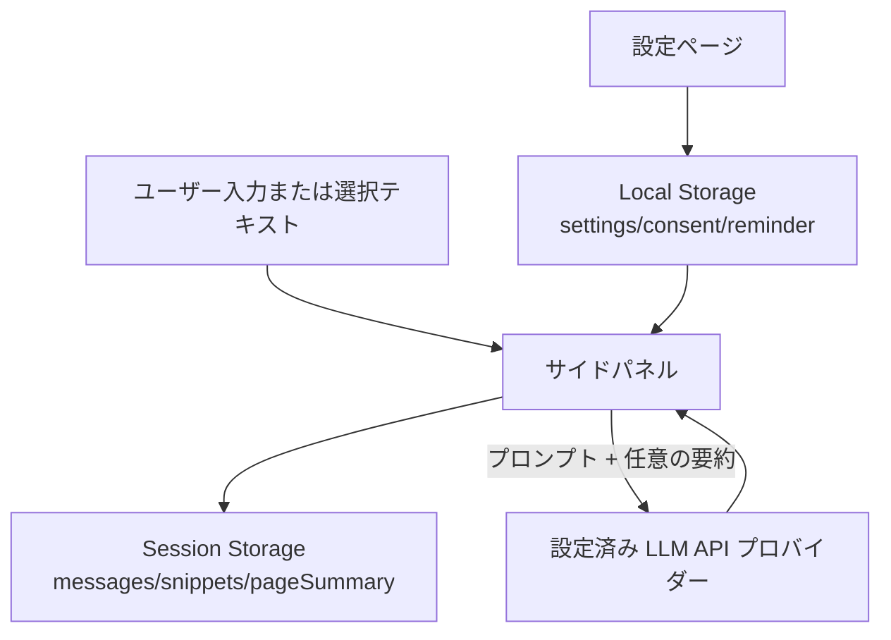

# Web LLM Assistant

ページ内容を文脈として使える、サイドパネル型の OpenAI 互換 LLM チャット拡張機能です。

## 言語

- [English](https://github.com/SunParis/Web-LLM-Assistant/blob/main/docs/README.en.md)
- 日本語（このページ）
- [繁體中文](https://github.com/SunParis/Web-LLM-Assistant/blob/main/docs/README.zh-Hant.md)
- [简体中文](https://github.com/SunParis/Web-LLM-Assistant/blob/main/docs/README.zh-Hans.md)

## 主な機能

- タブ/ページ単位のサイドパネルチャット。
- Web ページで選択したテキストを右クリックで文脈追加。
- メッセージの編集・再送・コピー・削除。
- 生成中の停止。
- 回答前にページ要約を自動生成（失敗時はフォールバックして回答継続）。
- アシスタント欄に要約ステータス（試行中/成功/失敗）を表示。
- アシスタント応答は2段表示（要約ステータス行 + 最終回答行）。
- 再送信/編集時に一時的な要約ステータス行を除去（要約キャッシュは保持）。
- 「このページの履歴をクリア」しても要約キャッシュは保持。
- ページ単位のセッション履歴保存。
- API エンドポイント、API キー、モデル、プロンプト、サンプリング値を設定可能。
- UI 言語オプション:
  - English (`en`)
  - 日本語 (`ja`)
  - 繁體中文 (`zh-Hant`)
  - 简体中文 (`zh-Hans`)

## インストール（開発者モード）

1. Chrome/Edge の拡張機能ページを開く。
2. 開発者モードを有効化。
3. 「パッケージ化されていない拡張機能を読み込む」をクリック。
4. `src/manifest.json` を含むプロジェクトフォルダを選択。

## 初期設定

1. 拡張機能設定（`options.html`）を開く。
2. 以下を設定:
   - OpenAI 互換 API URL
   - API キー
   - モデル名
   - プロンプトテンプレート（任意）
   - Temperature / Top P / Max Tokens
3. 設定を保存。
4. 必要に応じて API 接続テストを実行。

## 使い方

1. 拡張機能アイコンからサイドパネルを開く。
2. 入力欄に質問を入力して送信。
3. ページ文脈を追加する場合:
   - ページ上の文字を選択
   - 右クリックで Ask AI を選択

## 補足

- `pageSummary` は「このページの履歴をクリア」では削除されません。
- `pageSummary` はタブを閉じた時に削除されます。

## 法務・コンプライアンスに関する注意

- 本プロジェクトは法的助言を提供するものではなく、すべての法域での適法性を保証しません。
- ユーザーは、ウェブページ内容を第三者 LLM サービスへ送信する権利があることを自ら確認してください。
- 適法な根拠や許諾がない限り、個人情報・機微情報・機密情報・著作権保護コンテンツを送信しないでください。
- 各サイトの利用規約、robots/ポリシー制限、プラットフォーム規約を遵守してください。
- ユーザーは、適用される法令（プライバシー、データ保護、著作権、消費者保護等）を自ら遵守する責任があります。

### ユーザー向け免責文（推奨）

設定画面またはストア説明に以下のような文言を掲載できます。

「本拡張機能は、選択したページ本文および生成されたページ要約を、設定された LLM API プロバイダーへ送信する場合があります。権限のない個人情報・機密情報・著作権保護コンテンツは送信しないでください。本拡張機能の利用により、適用法令およびサイト利用規約を遵守する責任は利用者にあることに同意したものとみなされます。」

## データ保持ポリシー

- `chrome.storage.local`:
   - 設定のみを保存（API エンドポイント、モデル、言語、同意状態、リマインダー設定、プロンプト設定）。
- `chrome.storage.session`:
   - タブ/ページ単位の会話データを保存（`messages`、`snippets`、`pageSummary` キャッシュ）。
   - 「このページの履歴をクリア」実行時も `pageSummary` は保持。
   - タブを閉じると、そのタブの session データは削除。
- 本拡張機能自体は、独自バックエンド DB を使用しません。

## データフロー図

## ライセンス

[LICENSE](LICENSE) を参照してください。
