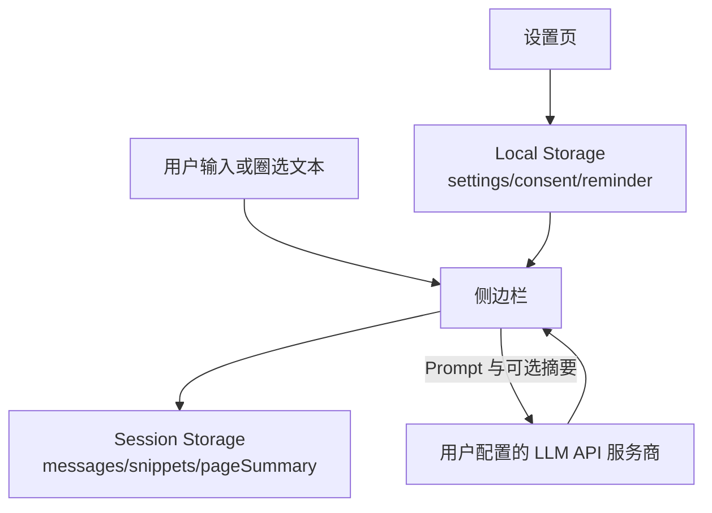

# Web LLM Assistant

一个可结合网页选取内容的侧边栏 LLM 助手，支持 OpenAI 兼容 API。

## 语言

- [English](https://github.com/SunParis/Web-LLM-Assistant/blob/main/docs/README.en.md)
- [日本語](https://github.com/SunParis/Web-LLM-Assistant/blob/main/docs/README.ja.md)
- [繁體中文](https://github.com/SunParis/Web-LLM-Assistant/blob/main/docs/README.zh-Hant.md)
- 简体中文（本页）

## 功能

- **安全与隐私增强**:
  - API Key 使用 Web Crypto API (`AES-GCM`) 在本地进行加密存储，防止明文泄露。
  - 侧边栏状态按标签页独立管理，防止上下文跨标签页泄露。
  - 会话密钥中的页面 URL 经过哈希 (`SHA-256`) 处理，且不再将 URL 包含在发给大模型的提示词中，保护浏览历史。
  - 存储访问级别得到严格限制 (`TRUSTED_CONTEXTS`)。

- 以标签页/页面为单位的侧边栏聊天。
- 通过右键菜单把网页选取文字加入上下文。
- 消息可编辑、重发、复制、删除。
- 流式生成中可停止。
- 回答前会自动尝试生成当前页面摘要（失败时会 fallback 并继续回答）。
- 会在助手消息中显示摘要状态（尝试中/成功/失败）。
- 助手回复采用两段式显示（摘要状态行 + 最终回答行）。
- 重新发送/编辑时会移除临时摘要状态行（但保留摘要缓存）。
- 清除当前页面聊天记录时，会保留摘要缓存用于后续提问。
- 每页会话历史保存。
- 可配置 API URL、API Key、模型、Prompt 与采样参数。
- 界面语言选项:
  - English (`en`)
  - 日本語 (`ja`)
  - 繁體中文 (`zh-Hant`)
  - 简体中文 (`zh-Hans`)

## 架构

- `src/sidepanel.js` 负责侧边栏主流程编排（状态流转、Chrome API 集成）。
- UI 渲染拆分到 `src/sidepanel_ui.js`，事件扩展点拆分到 `src/sidepanel_events.js`，API 通讯拆分到 `src/sidepanel_api.js`。
- 文本处理工具拆分到 `src/sidepanel_text.js`，图标常量拆分到 `src/sidepanel_icons.js`。

详细说明请参阅 [SIDEPANEL_ARCHITECTURE.md](SIDEPANEL_ARCHITECTURE.md)。

## 安装（开发者模式）

1. 打开 Chrome/Edge 扩展页面。
2. 开启开发者模式。
3. 点击“加载已解压的扩展程序”。
4. 选择包含 `src/manifest.json` 的项目目录。

## 设置

1. 打开扩展设置页（`options.html`）。
2. 填写以下项:
   - OpenAI 兼容 API URL
   - API Key
   - 模型名称
   - Prompt Template（可选）
   - Temperature / Top P / Max Tokens
3. 保存设置。
4. 可用 API 测试按钮检查连通性。

## 使用

1. 点击扩展图标打开侧边栏。
2. 在输入框直接提问。
3. 如需加入页面上下文:
   - 在网页中选中文字
   - 右键菜单选择 Ask AI

## 补充

- `pageSummary` 不会因为“清除当前页面聊天记录”被删除。
- `pageSummary` 仅在关闭该标签页时删除。

## 法律与合规声明

- 本项目不构成法律意见，也不保证在所有法域下自动合规。
- 用户需自行确认，是否有权将网页内容处理后发送至第三方 LLM 服务。
- 如无合法依据与授权，请勿提交个人信息、敏感数据、机密信息或受版权保护内容。
- 请遵守网站服务条款、robots/政策限制及平台规则。
- 用户需自行遵守所在地法律（例如：隐私、数据保护、版权、消费者保护等）。

### 建议对外展示的免责声明

可放在设置页或商店说明：

“本扩展可能会将你选取的网页文本与生成的页面摘要发送到你配置的 LLM API 服务商。未经授权请勿提交个人信息、机密信息或受版权保护内容。使用本扩展即表示你同意自行遵守适用法律与网站条款。”

## 数据保存策略

- `chrome.storage.local`:
   - 仅保存设置（API 端点、模型、语言、同意状态、提醒开关、Prompt 设置）。
   - API Key 在存入前通过 Web Crypto API 在本地加密，不保存明文密钥。
- `chrome.storage.session`:
   - 保存标签页/页面级会话（`messages`、`snippets`、`pageSummary` 缓存）。
   - 会话密钥使用页面 URL 哈希。
   - 用户清除当前页聊天时，`pageSummary` 仍会保留。
   - 标签页关闭时，该标签页 session 内容会删除。
- 本扩展自身不使用项目侧后端数据库。

## 数据流向图

## 许可证

请参阅 [LICENSE](LICENSE)。
