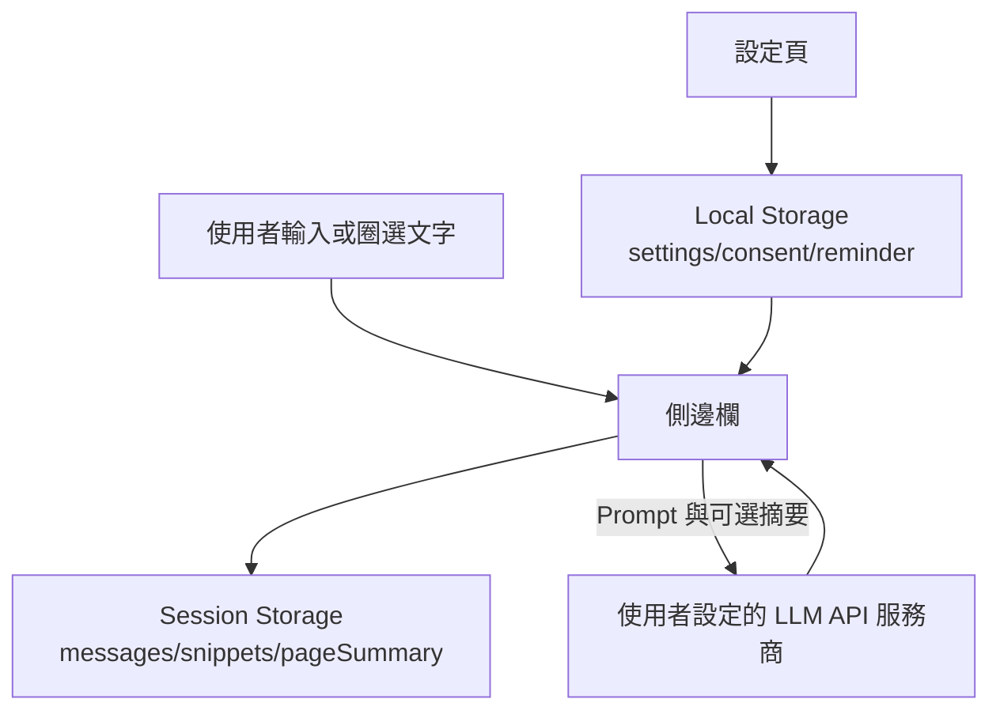

# Web LLM Assistant

可結合網頁選取內容的側邊欄 LLM 助手，支援 OpenAI 相容 API。

## 語言

- [English](https://github.com/SunParis/Web-LLM-Assistant/blob/main/docs/README.en.md)
- [日本語](https://github.com/SunParis/Web-LLM-Assistant/blob/main/docs/README.ja.md)
- 繁體中文（本頁）
- [简体中文](https://github.com/SunParis/Web-LLM-Assistant/blob/main/docs/README.zh-Hans.md)

## 功能

- **安全與隱私增強**:
  - API Key 使用 Web Crypto API (`AES-GCM`) 在本地進行加密儲存，防止明文外洩。
  - 側邊欄狀態按分頁獨立管理，防止上下文跨分頁外洩。
  - 會話金鑰中的頁面 URL 經過雜湊 (`SHA-256`) 處理，且不再將 URL 包含在發給大模型的提示詞中，保護瀏覽歷史。
  - 儲存存取級別得到嚴格限制 (`TRUSTED_CONTEXTS`)。

- 以分頁/頁面為單位的側邊欄聊天。
- 透過右鍵選單把網頁選取文字加入上下文。
- 訊息可編輯、重送、複製、刪除。
- 串流生成中可中止。
- 回答前會自動嘗試生成目前頁面的摘要（失敗時會 fallback 並繼續回答）。
- 會在助手訊息中顯示摘要狀態（嘗試中/成功/失敗）。
- 助手回覆採兩段式顯示（摘要狀態行 + 最終回答行）。
- 重新送出/編輯時會移除暫時性的摘要狀態行（但保留摘要快取）。
- 清除目前頁面聊天記錄時，會保留摘要快取供後續提問重用。
- 每頁會話歷史保存。
- 可設定 API URL、API Key、模型、Prompt 與取樣參數。
- 介面語言選項:
  - English (`en`)
  - 日本語 (`ja`)
  - 繁體中文 (`zh-Hant`)
  - 简体中文 (`zh-Hans`)

## 架構

- `src/sidepanel.js` 主要負責側邊欄流程編排（狀態流轉、Chrome API 整合）。
- UI 呈現拆分到 `src/sidepanel_ui.js`，事件擴充點拆分到 `src/sidepanel_events.js`，API 通訊拆分到 `src/sidepanel_api.js`。
- 文字處理工具拆分到 `src/sidepanel_text.js`，圖示常數拆分到 `src/sidepanel_icons.js`。

詳細請參考 [SIDEPANEL_ARCHITECTURE.md](SIDEPANEL_ARCHITECTURE.md)。

## 安裝（開發者模式）

1. 開啟 Chrome/Edge 的擴充功能頁面。
2. 開啟開發人員模式。
3. 點擊「載入未封裝項目」。
4. 選擇包含 `src/manifest.json` 的專案資料夾。

## 設定

1. 開啟擴充功能設定頁（`options.html`）。
2. 填入以下項目:
   - OpenAI 相容 API URL
   - API Key
   - 模型名稱
   - Prompt Template（選填）
   - Temperature / Top P / Max Tokens
3. 儲存設定。
4. 可使用 API 測試按鈕確認連線。

## 使用方式

1. 點擊擴充功能圖示開啟側邊欄。
2. 直接在輸入框提問。
3. 若要加入頁面上下文:
   - 在網頁上選取文字
   - 右鍵選單點選 Ask AI

## 補充

- `pageSummary` 不會因「清除此頁歷史」被刪除。
- `pageSummary` 會在關閉該分頁時刪除。

## 法律與合規聲明

- 本專案不構成法律意見，也無法保證在所有司法管轄區都自動合規。
- 使用者需自行確認，是否有權利將網頁內容處理後傳送至第三方 LLM 服務。
- 若無合法依據與授權，請勿提交個資、敏感資料、機密資訊或受著作權保護內容。
- 請遵守網站服務條款、機器人/政策限制與平台規範。
- 使用者需自行遵循所在地法律（例如：隱私、個資保護、著作權、消費者保護等）。

### 建議對外顯示的免責文字

可放在設定頁或商店說明：

「本擴充功能可能會將你選取的網頁文字與產生的頁面摘要，傳送到你設定的 LLM API 服務商。未經授權請勿提交個資、機密或受著作權保護內容。使用本擴充功能即表示你同意自行遵守適用法律與網站條款。」

## 資料保存策略

- `chrome.storage.local`:
   - 僅保存設定（API 端點、模型、語言、同意狀態、提醒開關、Prompt 設定）。
   - API Key 在存入前透過 Web Crypto API 在本地加密，不保存明文金鑰。
- `chrome.storage.session`:
   - 保存分頁/頁面層級會話（`messages`、`snippets`、`pageSummary` 快取）。
   - 會話金鑰使用頁面 URL 雜湊。
   - 使用者清除此頁聊天時，`pageSummary` 仍會保留。
   - 分頁關閉時，該分頁 session 內容會刪除。
- 本擴充功能本身不使用專案端後端資料庫。

## 資料流向圖

## 授權

請參考 [LICENSE](LICENSE)。
